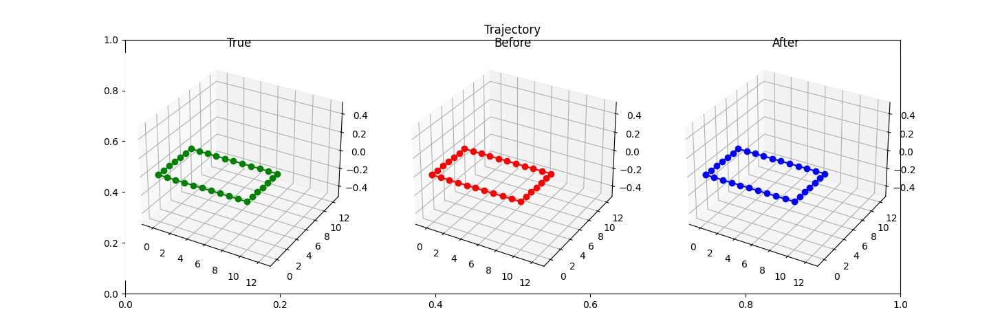
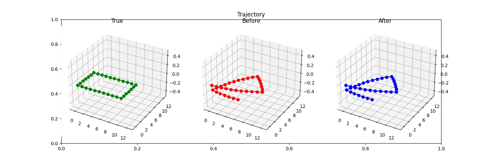
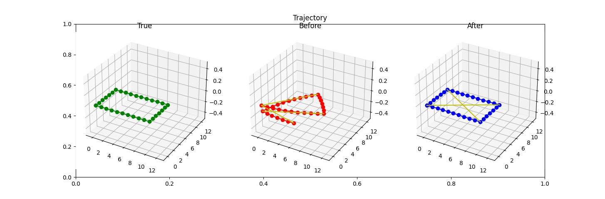
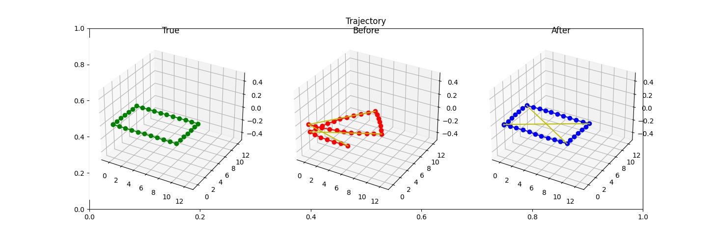
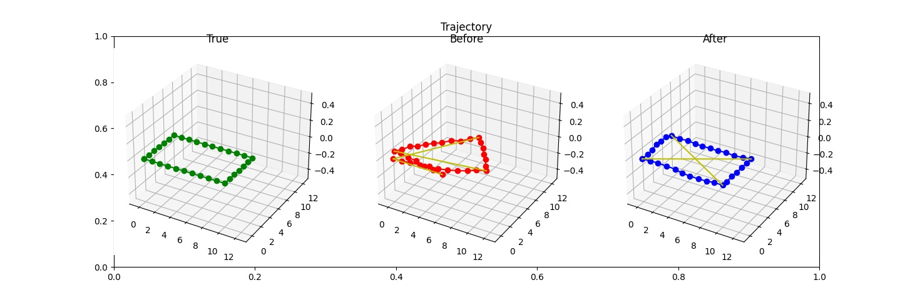
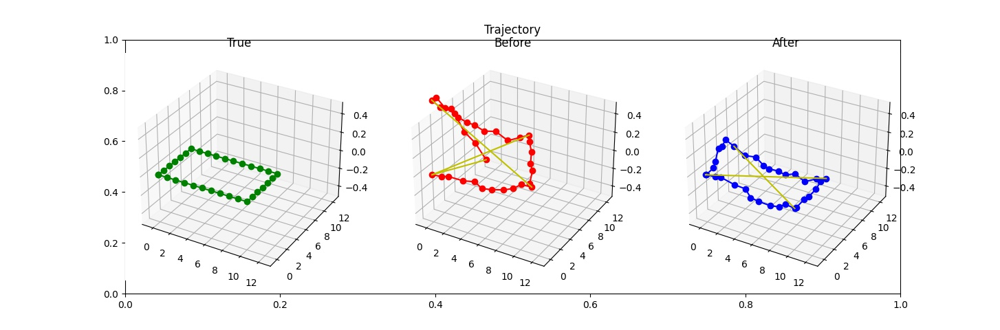
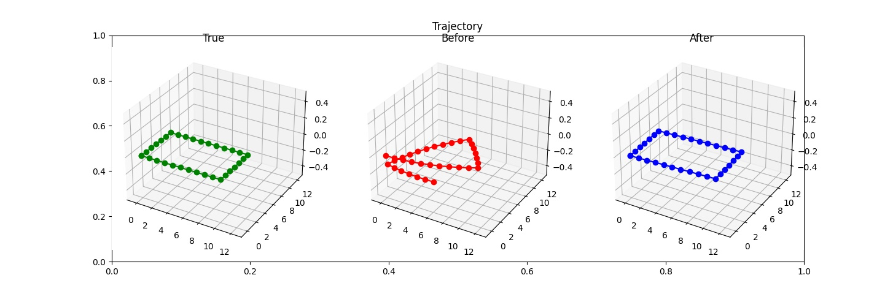
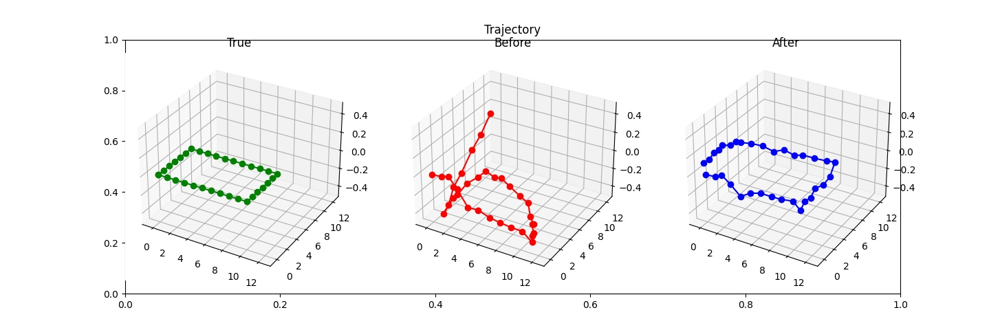

# Fun with Ceres and SLAM
I created this repo to try out the [Ceres](http://ceres-solver.org/) optimisation library.

The data is being optimised is a (very simply) simulated trajectory of some vehicle with odometry and perhaps other sensor measurements.

Noise, drift and various loop closure options are available.

## Requirements
[Ceres](http://ceres-solver.org/) and [Eigen](https://eigen.tuxfamily.org/dox/GettingStarted.html)
```shell script
sudo apt-get install libceres-dev libeigen3-dev
```
(alternatively you can use/install from source)

## Build
```shell script
mkdir build
cd build
cmake ..
make
```


## Run
```shell script
./build/simslam
```
Visualise results
```shell script
python plot_results.py ./build
```

## Notes
With no noise, drift or loop closures.  
The initial state of the trjaectory is exactly the true trajectory, and there is noting for the optimiser to do.
```shell script
./build/simslam 0 0 0 0
```


With a little drift.  
Now the initial values of the nodes in the trajectory are not correct (except the first), and the end position is clearly well off where it should be. 
In this case the only information available in the optimisation is a linear sequence of odometry measurements which is all self-consistent i.e. there's no other information to contradict the odometry, which is why the optimisation cannot fix this.
```shell script
./build/simslam 0 1 0 0
```


With drift and a loop closure observation (yellow line) between the start and end of the trajectory.  
Now we have an additional measurement between the start and end of the trajectory that is inconsistent with the odometry information. The optimisation is now able to 'correct' the errors in odometry. However, some 'warping' of the true trajectory remains (due to drift error in the translation element of the odometry measurement) which the single loop closure cannot fix, because it provides no additional information about the rest of the trajectory.   
```shell script
./build/simslam 0 1 1 0
```


With a few more loop closures.  
Now the warping is fixed - of course in practice it may not always be possible to generate such constraints exactly where we want.
```shell script
./build/simslam 0 1 2 0
```


Add some noise as well for a marginal increase in realism. This only adds noise to the x and y components of the relative motion.
```shell script
./build/simslam 1 1 2 0
```


Add noise to all components of the relative motions (translational and rotational).
```shell script
./build/simslam 2 1 2 0
```


Increase the noise! These (deliberately convenient) loop closures are quite effective.
```shell script
./build/simslam 3 1 2 0
```


Adding orientation edges to each node can also improve the optimised trajectory. 
This is some measurement of absolute orientation e.g. as we might get from an IMU (including magnetometer for heading).
In this example loop closure is removed completely.
```shell script
./build/simslam 0 1 0 1
```


It's quite effective even when there is a lot of noise on the relative motion and orientation measurements.
```shell script
./build/simslam 3 1 0 1
```



## TODO
Add more (simulated) sensor information...
 - Gravity vector instead from 'IMU' (i.e. no yaw information)
 - Absolute position measurements for a few nodes from 'GNSS'
 - Offset IMU and GNSS measurement frames, and then estimate (refine as part of optimisation)
 - Nicer input arguments!
 - Tidy noise generation parts
 - More sensible covariance/information matrix values
 - Allow visualisation of other edges (may want to change visualisation approach entirely)
 - Qualitative evaluation of optimised results vs ground truth
 